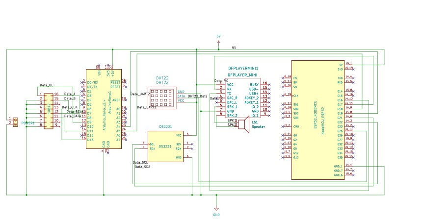
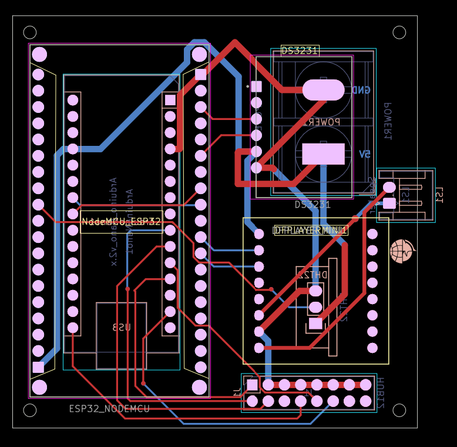
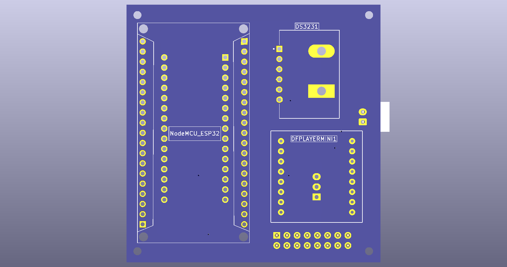
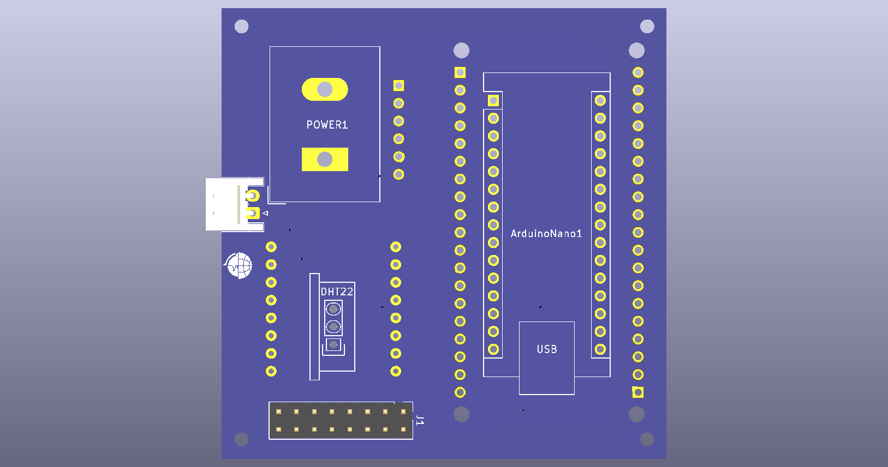

# 🕋 Custom Digital Clock PCB (ESP32 + Arduino Nano)

> A fully integrated, custom PCB redesign of the **Jakarta Dishub Digital Clock**, engineered to eliminate messy jumper wires and deliver a robust, production-ready hardware solution. ⚡

---

## 📸 Hardware Preview

| 📐 Schematic Design | 🖨️ PCB Routing (2D) |
| :---: | :---: |
|  |  |

| 🧊 3D View (Front) | 🧊 3D View (Back) |
| :---: | :---: |
|  |  |

---

## 💡 Overview

This system goes beyond a simple clock. It acts as a real-time information hub displaying **time, date, temperature, humidity, and dynamic motivational quotes** on a **P10 LED Panel**. 

To make it fully autonomous, it features **automatic Adzan audio playback** triggered at specific times via a DFPlayer Mini, all manageable through a **Wi-Fi-based web interface** 🌐.

### 🧠 Dual-Microcontroller Architecture
To handle high-speed display multiplexing without compromising IoT capabilities, the workload is split:
* **ESP32** → The "Brain" handling Wi-Fi, Web Server, sensor polling, and audio logic.
* **Arduino Nano** → The "Display Driver" dedicated entirely to driving the P10 HUB12 panel via I²C commands from the ESP32.

---

## ⚙️ Core Features

* 🕐 **Precision Timekeeping:** Driven by the highly accurate DS3231 RTC module.
* 🌡️ **Environment Monitoring:** Real-time data processing from the DHT22 sensor.
* 🔊 **Automated Audio:** DFPlayer Mini seamlessly plays MP3 files from an SD card.
* 💬 **Dynamic Quotes API:** Fetches and displays daily motivation.
* 🌐 **Local Web Interface:** Easy configuration of settings without hardcoding.
* 🔌 **Custom PCB Design:** Two-layer board integrating all modules flawlessly.

---

## 🎓 The PCB Design Journey

This repository marks my **first dive into designing a PCB from scratch using KiCad 10.0.1**. 

Instead of just wiring modules together, I took the time to understand:
* **Schematic flow and logical groupings.**
* **Netclass configurations** for handling power vs. data lines.
* **Trace routing** with wider tracks for power stability.
* **ERC/DRC validation** to ensure a safe, short-circuit-free design.

> 🎯 *Takeaway: This wasn't just about building a clock; it was a hands-on masterclass in bridging the gap between a messy breadboard prototype and a professional hardware product.*

Check out the original breadboard prototype here: 👉 [Jakarta Dishub Digital Clock v1](https://github.com/natael221/JAMDIGITALPUSDATINDISHUB)

---

## 🧰 Bill of Materials (BOM) Highlights

| Component | Role in the System |
| :--- | :--- |
| **ESP32 Dev Board** | Main IoT Controller |
| **Arduino Nano** | HUB12 Display Controller |
| **P10 LED Panel** | Main Visual Display |
| **DHT22** | Temp & Humidity Sensor |
| **DS3231 RTC** | Real-Time Clock |
| **DFPlayer Mini & Speaker** | Audio Subsystem |

---

## 🚀 Getting Started & Flashing Firmware

1. **Hardware Setup:** Connect both the ESP32 and Arduino Nano to your PC.
2. **Flash ESP32:** Compile and upload `main_esp32.ino` (Target: *ESP32 Dev Module*).
3. **Flash Nano:** Compile and upload `display_nano.ino` (Target: *Arduino Nano*, use Old Bootloader if necessary).
4. **Prepare Audio:** Load your Adzan `.mp3` files into the root/designated folder of a FAT32 formatted SD Card and insert it into the DFPlayer.
5. **Power Up:** Supply a stable **5V DC** to the board. The startup sequence will begin.
6. **Network Config:** Look at the P10 display for the local IP address, connect via your browser, and start configuring! 🎉

---

## 👨‍💻 About the Developer

**Natanael Siwalette** *Embedded Systems | IoT | Hardware Enthusiast*

Currently looking for new opportunities! (Yes, officially unemployed 😢😭, but always building).

📫 **Connect with me:** [LinkedIn](https://www.linkedin.com/in/natanael-siwalette)  
💻 **Check out my work:** [Portfolio](https://natael221.github.io/)

---

## 📜 License

This project is open-source for **educational, research, and prototype development purposes**. Feel free to fork, modify, or use it as inspiration. Proper credit is always appreciated 🙌.
